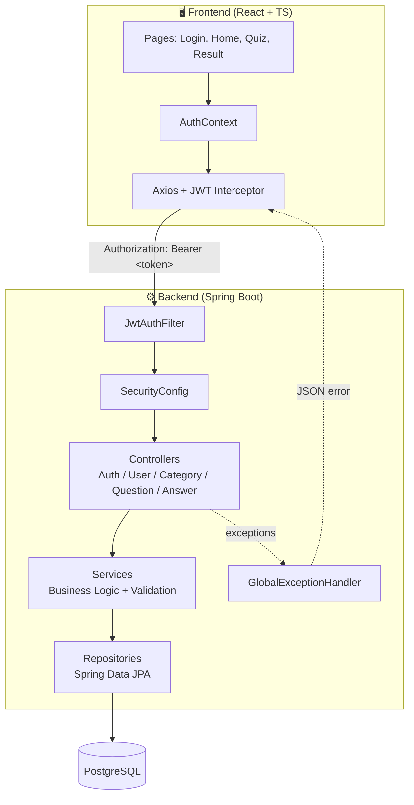
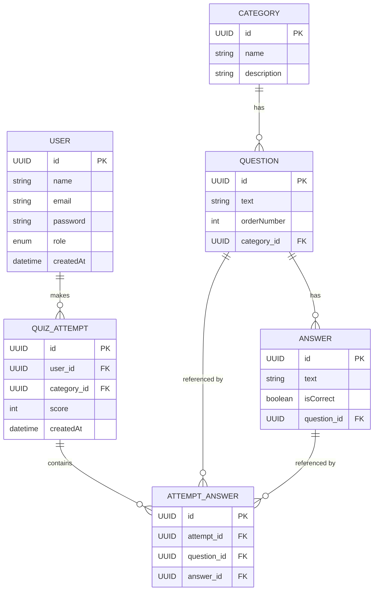

# 🎯 Quiz Platform

> A full-stack general knowledge quiz application built with **Java + Spring Boot** on the backend and **React + TypeScript** on the frontend, featuring JWT authentication, role-based access, and a clean layered architecture.


---

## 📖 Table of Contents

- [About the Project](#-about-the-project)
- [Features](#-features)
- [Tech Stack](#-tech-stack)
- [Architecture](#-architecture)
- [Database Schema (ER Diagram)](#-database-schema-er-diagram)
- [Authentication Flow (JWT)](#-authentication-flow-jwt)
- [API Endpoints](#-api-endpoints)
- [Screenshots](#-screenshots)
- [Getting Started](#-getting-started)
- [Project Structure](#-project-structure)
- [Business Rules](#-business-rules)
- [Roadmap](#-roadmap)
- [Lessons Learned](#-lessons-learned)

---

## 🧠 About the Project

**Quiz Platform** is a general knowledge quiz application where users can register, log in, and test their knowledge across different categories.

From the user's perspective:

1. **Register / Login** — create an account or sign in with email and password
2. **Choose a category** — e.g. Geography, Science, Sports
3. **Answer 10 randomly selected questions**, each with 4 multiple-choice options
4. Get **instant visual feedback** (green for correct, red for incorrect) after each answer
5. **View the final score** with a performance-based message
6. **Replay the quiz** anytime — questions are shuffled on every attempt

This project was built as part of a hands-on, mentor-guided learning path focused on **production-grade backend practices** (layered architecture, DTOs, security, exception handling) combined with a **modern React frontend**.

---

## ✨ Features

### Backend
- ✅ RESTful API built with Spring Boot 3.5
- ✅ JWT-based authentication & stateless sessions
- ✅ Password hashing with BCrypt
- ✅ Role-based structure (`ADMIN` / `PLAYER`)
- ✅ Layered architecture: Controller → Service → Repository → Entity
- ✅ DTO pattern for clean API contracts (no entity leakage)
- ✅ Centralized exception handling (`@RestControllerAdvice`)
- ✅ Business-rule validation (duplicate prevention, max 4 answers per question, etc.)
- ✅ PostgreSQL persistence with Spring Data JPA / Hibernate

### Frontend
- ✅ React 18 + TypeScript + Vite
- ✅ TailwindCSS for styling
- ✅ Global authentication state via Context API
- ✅ Axios with automatic JWT injection (interceptors)
- ✅ Protected routes (`PrivateRoute`)
- ✅ Randomized quiz flow with live scoring
- ✅ Responsive, dark-themed UI

---

## 🛠 Tech Stack

| Layer          | Technology                                   |
|-----------------|-----------------------------------------------|
| Language        | Java 21                                        |
| Framework       | Spring Boot 3.5.14                             |
| Security        | Spring Security + JWT (jjwt 0.12.6)            |
| Persistence     | Spring Data JPA / Hibernate                    |
| Database        | PostgreSQL 16 (Docker)                         |
| Build Tool      | Maven                                          |
| Frontend        | React 18 + TypeScript                          |
| Bundler         | Vite 5                                         |
| Styling         | TailwindCSS                                    |
| HTTP Client     | Axios                                          |
| Routing         | React Router DOM                               |
| API Testing     | Postman                                        |

---

## 🏗 Architecture

The backend follows a classic **layered (monolithic) architecture** — chosen deliberately over microservices to keep the project focused, testable, and appropriate for its scope.



### Layer Responsibilities

| Layer | Responsibility |
|---|---|
| **Controller** | Receives HTTP requests, maps DTOs ↔ Entities, returns `ResponseEntity` |
| **Service** | Business rules (duplicate checks, password hashing, validations) |
| **Repository** | Database access via Spring Data JPA |
| **Entity** | JPA-mapped domain models |
| **DTO** | Shape of data exposed to/from the API (never expose entities directly) |
| **Config** | Security, JWT, CORS, exception handling |

---

## 🗄 Database Schema (ER Diagram)



### Business Rules Summary

| Rule | Description |
|---|---|
| BR-001 | Each quiz consists of 10 randomly selected questions |
| BR-002 | Each question has exactly 4 answer options |
| BR-003 | Exactly 1 answer per question is marked `isCorrect` |
| BR-004 | Score ranges from 0 to 10 |
| BR-005 | Users can retake a quiz with newly shuffled questions |
| BR-006 | Every question belongs to exactly one category |
| BR-007 | Only `ADMIN` users can create/delete categories & questions |
| BR-008 | `PLAYER` users must be authenticated to play |
| BR-009 | Guests can only view categories (read-only access) |
| BR-010 | Duplicate answers (same text) for the same question are rejected |

---

## 🔐 Authentication Flow (JWT)

```mermaid
sequenceDiagram
    actor User
    participant FE as React Frontend
    participant Filter as JwtAuthFilter
    participant Sec as SecurityConfig
    participant Ctrl as Controller
    participant DB as PostgreSQL

    User->>FE: Enter email + password
    FE->>Ctrl: POST /api/auth/login
    Ctrl->>DB: Find user by email
    DB-->>Ctrl: User (hashed password)
    Ctrl->>Ctrl: BCrypt.matches(password, hash)
    Ctrl->>Ctrl: JwtService.generateToken(email)
    Ctrl-->>FE: 200 OK { token, name, email, role }
    FE->>FE: Store token in localStorage

    Note over FE,DB: Subsequent requests

    User->>FE: Click "Play Quiz"
    FE->>Filter: GET /api/questions/category/{id}<br/>Authorization: Bearer &lt;token&gt;
    Filter->>Filter: Extract & validate JWT
    Filter->>Sec: Set SecurityContext (authenticated)
    Sec->>Ctrl: Forward request
    Ctrl->>DB: Query questions
    DB-->>Ctrl: Questions
    Ctrl-->>FE: 200 OK [questions]
```

### Security Configuration Overview

```
Public endpoints (no token required):
  POST /api/auth/login
  POST /api/users                    (registration)
  GET  /api/categories/**
  GET  /api/questions/**
  GET  /api/answers/**

Protected endpoints (Bearer token required):
  All other requests (CRUD operations on categories,
  questions, answers, and user management)

Session policy: STATELESS (no server-side sessions)
Password encoding: BCrypt
Token expiration: 24 hours
```

> 🐛 **A real bug we debugged & fixed**: the `JwtAuthFilter` initially only called `filterChain.doFilter()` inside the `catch` block / early-return path. When a token was *valid*, the filter authenticated the user but never forwarded the request — resulting in a silent `200 OK` with an empty body. Fixed by ensuring `doFilter()` is called exactly once, at the end of the method, covering all three paths (no token / valid token / invalid token).

---

## 🔌 API Endpoints

### Auth
| Method | Endpoint | Access | Description |
|---|---|---|---|
| POST | `/api/auth/login` | Public | Authenticate and receive JWT |

### Users
| Method | Endpoint | Access | Description |
|---|---|---|---|
| POST | `/api/users` | Public | Register new user |
| GET | `/api/users` | Auth | List all users |
| GET | `/api/users/{id}` | Auth | Get user by ID |
| PUT | `/api/users/{id}` | Auth | Update user name |
| DELETE | `/api/users/{id}` | Auth | Delete user |

### Categories
| Method | Endpoint | Access | Description |
|---|---|---|---|
| GET | `/api/categories` | Public | List all categories |
| GET | `/api/categories/{id}` | Public | Get category by ID |
| POST | `/api/categories` | Auth | Create category |
| DELETE | `/api/categories/{id}` | Auth | Delete category |

### Questions
| Method | Endpoint | Access | Description |
|---|---|---|---|
| GET | `/api/questions/category/{categoryId}` | Public | List questions by category |
| GET | `/api/questions/{id}` | Public | Get question by ID |
| POST | `/api/questions` | Auth | Create question |
| DELETE | `/api/questions/{id}` | Auth | Delete question |

### Answers
| Method | Endpoint | Access | Description |
|---|---|---|---|
| GET | `/api/answers/question/{questionId}` | Public | List answers for a question |
| POST | `/api/answers` | Auth | Create answer (max 4 per question) |
| DELETE | `/api/answers/{id}` | Auth | Delete answer |

---

## 📸 Screenshots

> Add your screenshots to `docs/screenshots/` and reference them below.

| Login | Home — Categories |
|---|---|
|  |  |

| Quiz in Progress | Result |
|---|---|
|  |  |

---

## 🚀 Getting Started

### Prerequisites
- Java 21
- Node.js 20.17+
- Docker (for PostgreSQL)
- Maven

### 1. Start the database
```bash
docker start quiz-postgres
```

### 2. Run the backend
```bash
cd quiz-platform
mvn spring-boot:run
# → runs on http://localhost:8080
```

### 3. Run the frontend
```bash
cd quiz-platform-frontend
npm install
npm run dev
# → runs on http://localhost:5173
```

### 4. Test credentials
```
Email:    kaua@email.com
Password: 123456
```

---

## 📁 Project Structure

```
quiz-platform/                    # Backend (Spring Boot)
├── src/main/java/com/quizplatform/quiz_platform/
│   ├── config/          # Security, JWT, CORS, Exception Handler
│   ├── controller/       # REST endpoints
│   ├── dto/              # Request/Response DTOs
│   ├── entity/           # JPA entities
│   ├── repository/       # Spring Data JPA repositories
│   └── service/          # Business logic
└── src/main/resources/
    └── application.yaml

quiz-platform-frontend/           # Frontend (React + TS)
├── src/
│   ├── context/          # AuthContext (global auth state)
│   ├── pages/             # Login, Register, Home, Quiz, Result
│   ├── services/          # Axios instance + interceptors
│   └── types/             # Shared TypeScript interfaces
```

---

## ⚙️ Roadmap

- [x] Database modeling & entity relationships
- [x] Repository / Service / Controller layers
- [x] DTO mapping & validation
- [x] JWT authentication & route protection
- [x] CORS configuration
- [x] React frontend (auth, home, quiz, result)
- [x] Seed data for Geography category
- [ ] Seed data for Science & Sports categories
- [ ] Unit tests (Service layer)
- [ ] Deployment (backend + frontend)
- [ ] Professional documentation pass

---

## 📚 Lessons Learned

This project was an introduction to several production-grade concepts:

- **DTO pattern vs. exposing entities directly** — keeping API contracts independent from the database model
- **Dependency Injection** — letting Spring manage object lifecycles instead of manual instantiation
- **JWT authentication** — token generation, validation filters, and stateless sessions
- **CORS** — understanding the browser's same-origin policy and how to safely allow cross-origin requests between frontend and backend
- **Centralized exception handling** — translating exceptions into meaningful HTTP status codes (404, 409, etc.)
- **Debugging filter chains** — diagnosing a silent `200 OK` with empty body caused by an incomplete `FilterChain.doFilter()` call

---

## 👤 Author

**Kauã Rasera**
[GitHub](https://github.com/kauarasera)
